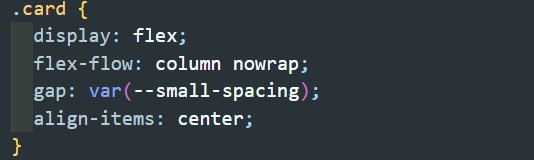

# apple 제품 카드

1. 전체 구성 접근 \
   처음 전체적인 코드 구성을 생각하면서 전체 배치를 다음 사진과 같이 고려하였음.

   - 전체 container는 class="cards"인 div태그로 묶음.
   - 각 카드 컴포넌트를 class="card-wrapper"인 div태그로 묶음.
   - 각 카드 컴포넌트의 구성은 제목, 설명 단락, 버튼으로 구성.
   - 아래쪽 4개의 컴포넌트는 grid 배치를 고려하여 class="grid-card"인 div태그로 묶음.
     

2. HTML 코드 구성

- .card 컴포넌트 안에 \<h2>를 이용하여 각 컴포넌트별 제목을 구성, \<strong> 태그를 사용하여 좀 더 굵게 보여지는 설명 단락을 구성, '출시일 추후 공개' 문구가 있는 카드 컴포넌트는 \
태그를 사용하여 구성하였음.

- 두 개의 버튼을 .btn으로 묶고 각각의 버튼에 .more와 .price 라는 클래스명을 부여함.

3. CSS 코드 구성

- 카드 컴포넌트

  - 화면 크기에 따른 반응형 구현

    - @container를 이용하여 64rem을 기준으로 글자 크기, 여백, 버튼 크기 등을 정의하였음.
    - 상단의 3개의 이미지가 화면 크기에 따라 다르게 나타나도록 코드를 구성하였음.

    

  - 해상도에 따른 배경 이미지 구분

    - 1x와 2x일때의 이미지를 구분하여 코드를 구성하였음.

    

  - 버튼 구분

    - 더 알아보기 버튼과 가격보기 버튼의 디자인 차이를 고려하여 css 코드를 구성하였음.

    - 각 카드의 배경 이미지를 고려하여 글자가 보일 수 있도록 css 코드를 구성하였음.

    
    

  - 배경 이미지 요소

    - 하단의 4개의 배경 이미지 크기를 고려하여 .card-wrapper 영역을 꽉차게 하도록 배경 이미지를 구성하였음.

    

- 카드 레이아웃

  - card 컴포넌트 안에 있는 요소들이 가운데 배치될 수 있도록 flex를 이용하여 배치하고 각 요소들 사이에 gap을 주어 여백을 줌.

  

  - 전체 .card 컨테이너를 grid로 배치하고 각 .card-wrapper 사이에 gap을 주어 각각의 카드 사이를 띄움.

  

  - 하단의 4개의 이미지가 화면 크기에 맞춰 반응할 수 있도록 grid로 배치하고 grid-templete-columns를 auto-fit으로 줌. 이때, minmax() 함수를 이용하여 최소 크기를 배경 이미지의 크기로 지정함으로써 전체 화면이 작아지면 배치가 달라지도록 함.

  

4. 결과

- 배포 주소: https://somin2352.github.io/homework/apple/apple.html

5. 결론

- 새롭게 알게된 점

  - background-image에서 해상도별 이미지를 불러올 때, image-set을 사용하여 여러 이미지를 불러올 수 있다는 점을 알게 됨.
  - 수업 시간에 해봤던 것처럼 css를 component 파일과 layout 파일로 나누어서 작업을 하니까 덜 복잡해서 스스로 코드를 정리하고 작성하는 데에 편리함을 느꼈음.

- 아쉬웠던 점
  - .watch, .macbook, .airpods 카드 컴포넌트에서 배경 이미지의 포커스 위치가 원하는대로 보여지지 않음.
    - 글자와 주요 이미지 부분이 겹치거나 이미지가 잘리는 현상 발생
    - background-postion을 이용하여 배경 이미지 포커스를 조정하도록 시도했으나 이미지 높이에 제한이 있어 의도한 형태로 나오지 않음.
